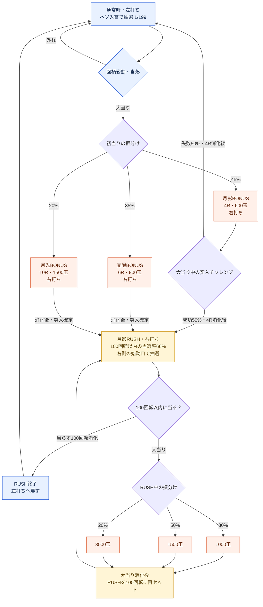

# 初号機「月影機関」採用遊技フロー

2026-09-30確定：RUSHは100回転以内の当選率66%（1回転は約1/93.195657）。1回外れても続き、100回転を当らず消化すると終了。RUSH当り後のみ1000/1500/3000玉＝30/50/20%へ変更。通常時の払出は変更しない。以下の旧演出・表示の説明は開発履歴を含み、最新の採用外観はDESIGN.mdを参照する。

2026-09-23。ユーザーの「いいと思います」により、提示したフローを初号機の基本方針として採用。数値は初期設定値として採用し、試遊による調整対象とする。以下のRUSHとR昇格方式を実装した。機種表・抽選・右側始動口・専用LCDを接続し、基準値を調整画面で変更できる。実機の一機種を複製したものではない。

## 体験の軸

初当りで出玉を得てRUSH突入を目指す。RUSH中は100回転以内に次の当りを引き、当るたび100回転へ戻る。初当りの入口、当り中の昇格、残り回転数からの引戻しの3箇所で期待を作る。保留5個・深い保証天井・ステージ・強化はゲーム側のルールとして維持する。

## フロー

## 初期設定値と意味（調整可能）

- 初当り1/199は基準案を継承。初当り振分け45/35/20は現在の試作値を利用。
- 初当りからのRUSH突入率は45%×50%＋35%＋20%＝77.5%。4Rの失敗でも4R分の賞球は得られる。
- RUSHは1回の消化抽選につき `p=1-0.34^(1/100)`、100回で少なくとも1回当る確率は `1-(1-p)^100`＝66%。独立抽選・スキル補正なし・100回転部分のみ。別の66%抽選を最後に行う方式ではない。残り回転数から変動中と右保留の予約数を差し引いて受付可能数を制限する。100回転を超える残保留抽選は追加しない。
- 「回転」は玉の発射数ではなく、図柄の抽選消化回数。大当りラウンド消化中はRUSH回転数を消費しない。
- 600/900/1500玉は基礎賞球15×10カウント×4/6/10R。全カウント入賞時の払出で、発射消費を引く前・コース倍率や永続／ラン内強化を加える前。時間切れで入賞が不足すれば減る。
- 100回転と100回転以内66%は採用フローの初期設定値であり、実機の平均値という意味ではない。

## 演出

- 通常は左→中央→右停止。リーチは左・中央一致後に告知し、右の決着まで戦闘・復活等で期待を作る。
- 初当り4Rは敵撃破／防衛成功でRUSH、敗北なら出玉を得たうえで通常へ。演出結果は選ばれた突入結果を表現し、ボタン入力等で再抽選しない。
- RUSH中は通常より短い変動が中心。残り回転数が少ないときのリーチ、当り中のR昇格で盛り上げる。
- R昇格：当選時に決まった最終4R/6R/10Rを段階的に告知する。4R表示から6R、さらに10Rへ見せる場合がある。初めから10R確定を見せる場合も用意する。

## 実装した状態遷移

- 右側の始動口（電チュー相当）とRUSH状態を追加した。RUSH中もアタッカーが開きっぱなしという意味ではない。抽選用の入口と当選後の賞球用アタッカーを分ける。
- 現在の同一大当りへ新規抽選でR数を繰り返し追加する方式を、「当選済みの最終R数を途中で告知する演出」と「RUSHで次の大当りを引く継続」に置き換えた。最終R数は当選時に固定し、R昇格で追加の当落・R抽選を行わない。
- 追加のLT、出玉なしのRUSH再セット、複数大当りセットは初号機案には入れない。既存の深い天井はゲーム救済として維持する。
- ステージ目標達成はどの状態でも発生し、一時停止してスキル選択。持ち玉・大当りの進行に加えてRUSH残り回転数・保留もそのまま引き継ぐ。最終ステージで終了する既存ルールを維持。
- 初期持ち玉・ステージ目標・RUSH中の玉持ちは、このフローに合わせて調整する必要がある。継続率だけで遊びやすさや攻略難易度を保証しない。

## 保留・終了境界・表示

- 通常ヘソ保留と右側のRUSH保留を別々に保存する。RUSH中の通常保留は消化せず、通常へ戻ってから再開する。各保留には入賞時の乱数・確率・種別を保存する。
- RUSHは100回転の予約枠。右保留に加えて変動中1回も残数から予約し、上限を超える抽選を受け付けない。残り1回で追加玉や二重抽選スキルを発動しても、101回目を作らない。
- 最終回転の当りは有効。演出と大当りを消化してから100回転へ戻す。最終回転が外れならRUSHを終了する。100回転後の追加ST抽選や最後の継続率抽選はない。
- 天井と通常側の確率補正は通常抽選だけに適用。RUSHは基礎約1/93.195657の抽選を行い、大当り消化中は回転数を減らさない。
- RUSH専用LCDは専用背景、残り回転数、連数、獲得出玉を表示。獲得出玉には突入した初当りの実際の賞球、コース・強化加算を含む。発射消費を引いた差玉とは別。
- BONUS専用LCDは消化Rと現在告知済みの総Rを表示。未告知の最終Rや突入結果を先に表示しない。4R→6R→10Rの告知は最終数を変えない。
- 4Rチャレンジ中も規定の賞球を消化する。判定だけを理由にアタッカーを閉じない。失敗後も取得済み4Rを消化し、短い結果表示を経て通常画面へ戻す。
- RUSH終了・突入失敗の結果画面は2.6秒で消える。その間も通常遊技は再開し、画面に「通常遊技へ」と表示する。一時停止時は表示時間も停止する。
- 効果音は今回変更しない。

## 用語の参照

SANKYO「初心者にもわかるスペックの見方～パチンコ篇①～」https://www.sankyo-fever.jp/research/31/ 。通常／高確率状態、ST回数、電サポ、ラウンド・カウント・払出の区別を参考にした。上記の名称・確率・振分けは架空台の初期設定値。
