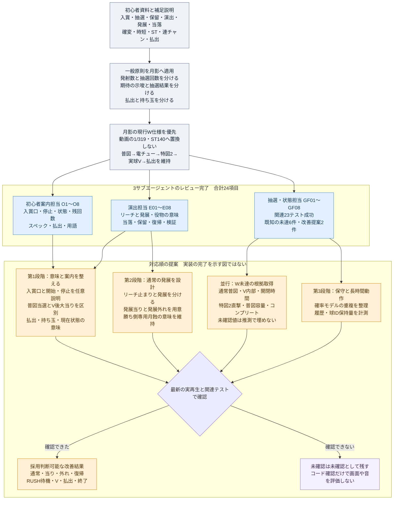

# 月影機関の改善点一覧と担当レビュー

2026-10-05。初心者講座の[パチンコ概要と全体図](../../../transcripts/パチンコ概要_IRvp0ammDbg.md)に、会話で確認した「発展」の説明を加え、月影機関の現行コードと比較しました。3つのサブエージェントが並行レビューし、改善候補24項目を整理しています。

このページは実装前のレビュー記録です。その後のユーザー指示により内部処理・演出を実装・検証し、動作確認動画を作成しました。マニュアル追加は最新の方針により撤去しました。[実装結果・動画・残る6項目](implementation.md)を参照してください。以下のレビュー時点の未検証記述と、実装後の確認結果を区別します。

## 資料から月影へ適用する原則

- 玉の発射、入賞、抽選、変動、保留を別の出来事として理解できること。
- 予告・リーチ・発展が、当たりへの期待を伝えること。発展と当たり確定を混同しないこと。
- 抽選結果を演出で変更しないこと。一方、後続の別抽選や実球V成立までを、最初の演出だけで完了扱いしないこと。
- 確率と入賞補助、残回数と発射数、振り分けと継続率を区別すること。
- 払出、発射で消費した玉、現在の持ち玉、差玉を区別すること。

動画の1/319・ST140回・時短100回は一般説明の例です。月影は[現行仕様](../../../pachinko.md)のW移行方針を優先します。初心者資料に合わせてSTや確変ループへ戻す改善は提案していません。[採用済みデザイン](../../DESIGN.md)の台中心表示、操作情報の初期非表示、人物・ドット絵・月予告12値も前提にしています。

## 先に着手する候補

1. **開始前の短い遊び方説明**：どこへ入れば抽選になるか、自動発射と停止の場所、左右自動切替を任意の説明で示す。O1・O2。
2. **当選と払出成立の区別**：RUSHの普図当選、電チュー開放、V待機、大当り成立、実払出を説明・表示上でも区別する。E03・O3・O4・O5。
3. **通常リーチからの発展を設計**：本編の中央図柄待ちから、次の場面へ進む入口を別に設ける。発展外れも含め、勝ち側専用の月蝕役物の意味を変えない。E01・E02。
4. **W未達の根拠取得を並行する**：通常普図、V内部、開閉時間、直撃分岐、普図保留容量、コンプリート。確認できた範囲から実装へ進める。GF01〜GF06。
5. **情報と保守の整備**：保留の現在枠、月予告の説明、回転数の意味、確率モデルの重複、履歴保持量を整える。E04・E05・O6〜O8・GF07・GF08。

P1は意味の取り違えを減らす候補とW再現への主要未達、P2は次の精度・情報・保守改善、P3は検証資料の整備です。優先度はこのレビューでの提案であり、確定不具合や採用済み仕様を示すものではありません。

## 全24項目

### 抽選・状態・保留・払出

詳細な根拠行、対応案、完了条件、今回実行したテストは[抽選・状態担当レビュー](game-flow.md)にあります。GF01〜GF06は既知の未達を現行コードと照合したものです。

| ID | 優先度 | 区分 | 改善点 | 対応と完了条件の要点 |
|---|---|---|---|---|
| GF01 | P1 | 既知の未達 | 通常時の低確普図抽選・短開放 | W固有根拠を取得し、通常とRUSHの受付・抽選・開閉を分離。特図やRUSH回数を誤加算しない。 |
| GF02 | P1 | 既知の未達 | V判定をアタッカー最初の入賞から分離 | 内部経路と独立Vセンサーの根拠を取得。V実通過、非V、時間切れ、賞球を別に追跡する。 |
| GF03 | P1 | 既知の未達 | 電チュー・小当り・アタッカーの開閉パターン | 未測定の試作時間を再現値と扱わず、測定できた対象だけ更新。自然発射で不足と時間切れも確認する。 |
| GF04 | P1 | 既知の未達 | 特図2の直撃と小当りを分岐 | 分母・振り分けの根拠取得後、入賞時に分岐を保持。直撃とV必須の小当りを混同しない。 |
| GF05 | P2 | 既知の未達 | 普図保留容量4という仮定を確認 | 特図1の容量を流用せずWの容量を確認。満杯・FIFO・残回数境界を検証する。 |
| GF06 | P2 | 既知の未達 | W固有のコンプリート制御 | 適用条件、警告、計数、停止、リセットの根拠を取得。残高不足による終了と区別する。 |
| GF07 | P2 | 改善提案 | 公表集計・四分岐・演出事前確率の一元管理 | 共通モデルから表示と演出側の値を導く。現行当落分布と払出を維持する。 |
| GF08 | P2 | 計測を伴う提案 | 長時間のイベント履歴・捕球ID保持量 | 実測後に保持上限を設計。収支、FIFO、重複入賞拒否を維持する。未計測の障害は断定しない。 |

### 演出・発展・当落の伝達

詳細は[演出担当レビュー](presentation.md)にあります。見た目の問題は実再生で確認してから変更を決める項目を含みます。

| ID | 優先度 | 区分 | 改善点 | 対応と完了条件の要点 |
|---|---|---|---|---|
| E01 | P1 | 内容追加の提案 | リーチと発展の段階を分ける | 通常リーチ止まり、発展当り、発展外れの絵コンテを作る。保留・W結果・払出を変えない。 |
| E02 | P1 | 意味の整理 | 勝ち側専用の月蝕役物と発展入口を区別 | 月蝕は既存の意味を保持。外れもある発展入口には別の転換・人物表現を用意する。 |
| E03 | P1 | 意味の点検 | 普図当選とV後の大当り成立を区別 | 電チュー開放後の右打ち継続・獲得待機を伝える。V未成立・時間切れも確認する。 |
| E04 | P2 | 説明の提案 | 月予告12値の対象と期待度を説明 | 任意説明で形×色、外れの可能性、通常とRUSHの示唆対象を示す。12値と初出色固定を維持する。 |
| E05 | P2 | 表示の提案 | 現在の変動と待ち保留を形でも区別 | 現在枠の縁・形と繰上げ動線を整理。保留の期待色や容量は変更しない。 |
| E06 | P2 | 実再生後に判断 | リーチ外れの停止・復帰を読み取りやすくする | 不揃いを読める保持から次変動へ。通常とRUSHを別評価し、開閉時計を変えない。 |
| E07 | P2 | 実表示の確認 | 777の揃い、拡大、役物、案内の読み取り順 | スマホ・PCと3表示で連続撮影。大きな図柄の一部が見えることと777成立の判読を分けて評価する。 |
| E08 | P3 | 検証整備 | 現行シナリオ一覧と再生記録を一体化 | 通常外れ・月予告・当り・CHARGE・V待機・成立・終了を撮影。試遊と自然入賞を区別する。 |

### 初心者案内・操作・数値の読み方

詳細は[初心者案内担当レビュー](onboarding.md)にあります。説明は主に機種詳細や任意ヘルプへ置き、常設HUDを増やすことを前提にしていません。

| ID | 優先度 | 区分 | 改善点 | 対応と完了条件の要点 |
|---|---|---|---|---|
| O1 | P1 | 任意説明の提案 | ヘソ・一般口・普図・電チュー・アタッカーの役割 | 盤面図と短い流れで説明。発射数と抽選回数、賞球と抽選入賞を区別できる。 |
| O2 | P1 | 開始前案内 | 自動発射・停止場所・左右自動切替 | 玉消費が始まる前に説明を読める。操作パネルの初期非表示と開閉時の遊技継続を維持する。 |
| O3 | P1 | 数値の説明 | 公表払出・実払出・持ち玉・差玉を区別 | 3000は1500×2の公表値で、差玉保証ではないと説明。結果画面の発射数と収支が一致する。 |
| O4 | P1 | 任意情報の提案 | 現在状態とRUSH残回数の意味 | 普図消化中、電チュー・V・払出待機を補助。残回数0だけで未完了の払出を終了扱いせず、未告知結果を漏らさない。 |
| O5 | P1 | スペック解説 | 図柄揃い・チャージ・突入率の母数 | 分岐図と説明を追加。合算初当り全件に51%を一律適用する誤読を避け、暫定policyを確定仕様と混ぜない。 |
| O6 | P2 | 用語説明 | リーチ・発展・期待度と当たり確定を区別 | 現行で存在する経路だけを例示。新しい発展を採用した後に説明を合わせる。 |
| O7 | P2 | 集計の定義 | 回転数が通常特図とRUSH普図の通算であること | まず現行値の意味を明記。別集計を追加するなら受付と消化を二重計数しない。 |
| O8 | P2 | 個体差の説明 | 台番号・釘配置と抽選確率の違い | 同機種の抽選仕様は共通、釘配置で玉の流れが異なると詳細で説明する。 |

## 維持すべき実装と今回の検証

入賞時の乱数保持、保留FIFO、特図2の次開始優先、RUSH130回の消化、実球を使う3000払出、6000＋αの追加入賞、ポーズ・終了処理は実装済みとしてレビューしています。右左カットイン、RUSH残回数、CHARGE、現在払出/最大払出も存在します。「これらをゼロから追加する」課題にはしていません。

抽選担当が、controller/spec/session/実物理橋/lifecycleの既存テストを今回実行し、**23件成功・失敗0**を確認しています。成功は現行policyの整合性を示すもので、未測定のV内部・開閉時間・普図容量が実機と一致した証拠ではありません。今回、画面・聴感・実端末・長時間性能は検証していません。

採用して実装する際は、最新ソースでスマホ縦画面とPC、全体/盤面/液晶、通常外れ/発展/当り/復帰、CHARGE、RUSH普図当選/電チュー/V/払出/終了を再確認します。強制当選の試遊は演出確認に限定し、自然入賞や確率分布の確認と分けます。

## サブエージェントの担当と成果

| 担当 | 成果 | 状態 |
|---|---|---|
| 抽選・状態・保留・払出 | [game-flow.md](game-flow.md)、GF01〜GF08、関連23テスト | レビュー完了 |
| 演出・見た目・発展・当落 | [presentation.md](presentation.md)、E01〜E08 | コードレビュー完了、実表示未検証 |
| 初心者案内・操作・スペック | [onboarding.md](onboarding.md)、O1〜O8 | コードレビュー完了、実表示未検証 |

## 資料から改善までの Mermaid

[独立したMermaidファイル](improvements.mmd)も保存しています。

## ユーザー訂正：ゲーム内部の改善

マニュアル追加は意図と異なるため撤去した。[案内追加の記録](guide-update.md)は撤回済みの履歴。[確率モデル・イベント履歴・捕球IDの改善](game-flow-implementation.md)と、[演出中の機械時計の整理](internal-clock.md)が内部処理の対応。
