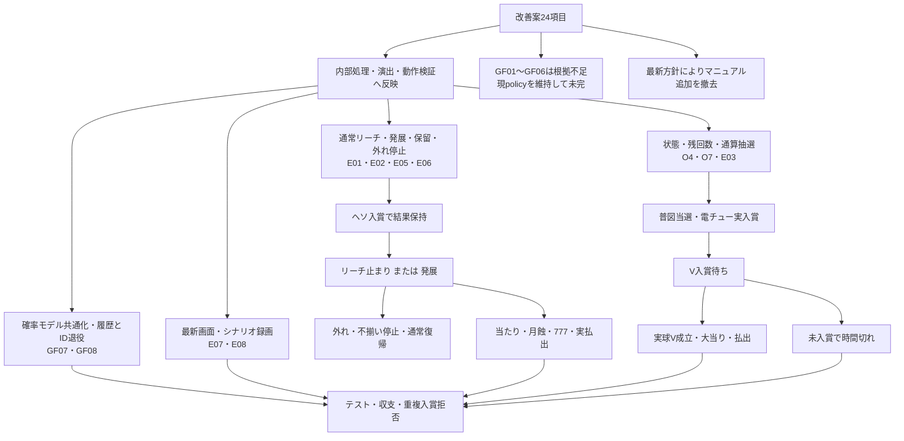

# 月影機関 改善実装と動作確認

2026-10-05。[改善案24項目](README.md)を基に、内部処理・発展・状態表示・保守をローカルへ実装した。3担当が直接実装し、統合後のChrome画面を新しく撮影した。DESIGN.mdの最新訂正を優先し、マニュアル追加は撤去した。

## 動画

[動作確認MP4（約2分11秒・等速・無音）](../../../../prototype/reference-review/improvements-2026-10-05/月影_改善実装_動作確認.mp4)

| 開始位置の目安 | 内容 | 確認方法 |
|---|---|---|
| 00:00 | 通常の自然発射・状態進行 | 通常遊技。自然発射・実入賞・収支整合を確認。 |
| 00:10 | リーチ止まり→外れ | 開発時だけ結果・演出を指定。有料の実球をヘソ直上へ配置。 |
| 00:18 | 発展→外れ→通常復帰 | 同上。発展が当たり確定にならないことを確認。 |
| 00:28 | 発展→当たり・月蝕・777・筐体 | 同上。通常時の当選結果は変更せず、演出から再抽選しない。 |
| 00:48 | RUSH→電チュー→V待機→払出 | 初期RUSHと初回当選のみ固定。玉は自然発射・実入賞。 |
| 01:10 | CHARGE 300→払出→通常 | 最初のヘソ2球を配置・チャージ固定。その後は自然発射で300払出と収支一致。 |
| 01:41 | V未入賞の時間切れ | 普図・電チューへ確認用の有料実球を配置。発射停止のまま待機し、大当り未成立を確認。 |
| 02:02 | RUSH残り1回→終了→通常 | 残1回・外れを指定。普図口へ有料実球を配置して最終回の境界を確認。 |

強制条件は字幕で示している。入口直上への球配置は撮影・試験用で、本番の発射や入賞補助へ追加していない。録画はライブ画面をキャプチャし、読み込み区間を切り出して接続した。速度変更・静止画による代替・音の付加はしていない。

[録画の状態検証](../../../../prototype/reference-review/improvements-2026-10-05/check.json)、[編集の元ファイルと切出範囲](../../../../prototype/reference-review/improvements-2026-10-05/edit.json)、[録画スクリプト](../../../../prototype/reference-review/improvements-2026-10-05/record.mjs)も保存した。

## 改善案ごとの実装結果

| ID | 今回の結果 |
|---|---|
| GF01〜GF06 | 公式一次資料を調査したが、通常普図・内部V・開閉時間・直撃分岐・普図容量・コンプリートの制御値を確定できなかった。既存policyを維持。未完として[調査記録](game-flow-implementation.md)へ保存。 |
| GF07 | 公表近似の四分岐と演出priorを共通モデルへ集約。既存分布と境界を維持。 |
| GF08 | 消費済みWイベントを直近2048件、入賞観測を100件＋累計へ整理。球IDは生存球より古い範囲だけ退役し、古い遅延入賞は恒久拒否。 |
| E01 | 通常リーチから、月光収束→剣の光→一閃→当落へ進む発展を追加。リーチ止まりと発展外れも保持。 |
| E02 | 発展入口の光・斬撃と、勝ち側だけの月蝕役物を別の段階にした。 |
| E03 | 液晶へ「電チューへ」「V入賞待ち／右打ち継続」を追加。任意パネルでも普図・V・実払出を区別。V時間切れで大当り0を確認。 |
| E04 | 月予告12値・入賞口図などの任意マニュアルは、最新の内部処理中心の方針により撤去。月予告そのものの12値は維持。 |
| E05 | 消化中の保留へ角の括弧を追加し、色以外でも待ち保留と区別。容量と繰上げは既存どおり。 |
| E06 | 通常リーチ外れの不揃い停止を0.7秒保持。RUSH短尺は維持。演出中も機構の既存開閉期限を進め、ポーズ時は両方の時計を止める。 |
| E07 | PCでは液晶で発展〜777、全体で筐体、盤面でRUSHを確認。スマホ縦幅390×844の3表示で発展・拡大・777停止を撮影。既採用6倍ズーム中は図柄が開口から切れ、約1.51秒後に3図柄が収まる。拡大瞬間だけを777判読の根拠にしていない。 |
| E08 | 通常・リーチ止まり・発展当たり／外れ・CHARGE・普図当選・電チュー・V成立／時間切れ・払出・RUSH終了を今回のソースで録画／状態検証。 |
| O1 | 入賞口の番号図・任意ヘルプは最新方針により撤去。 |
| O2 | 開始前の発射説明・追加ヘルプは撤去。既存の自動発射／停止／一時停止を維持し検証。 |
| O3 | 追加ヘルプは撤去。実払出・持ち玉の計算を維持し、結果画面の数値の意味を明記。 |
| O4 | 操作パネルへ現在状態・RUSH残回数を追加。未告知の当選結果を読まず、残0でも未処理のV／払出を終了扱いしない。 |
| O5 | スペックの追加解説は撤去。内部の四分岐・公表母数・演出priorを共通定義へ整理。 |
| O6 | 用語の追加ヘルプは撤去。発展演出は当たり／外れの既存結果を保ったまま進む。 |
| O7 | 回転数を「通算抽選回数」と表示し、通常図柄とRUSH普図の通算だと説明。 |
| O8 | 個体差の追加説明は撤去。同機種の抽選仕様と既存の台別釘配置は維持。 |

発展の時刻と各場面は[絵コンテ](development-storyboard.md)に記録した。発展の選択にゲーム乱数を追加消費しない。W仕様・出玉・左右自動切替・玉の物理・自然入賞は今回の演出によって置き換えていない。

## 検証

- 全体テスト298件成功。その後の補足実装に対する関連20件も成功。追加のLCD待機表示・未告知結果を漏らさない確認、演出中の機構期限・ポーズ時の時計停止を含む。[全体ログ](../../../../prototype/reference-review/improvements-2026-10-05/tests.log)・[最終関連ログ](../../../../prototype/reference-review/improvements-2026-10-05/final-related-tests.log)。
- 最終ビルド成功。[ログ](../../../../prototype/reference-review/improvements-2026-10-05/build.log)。既存の大きなチャンク警告は残る。
- 最終画面のChrome操作テスト成功。操作欄初期非表示・メニューのフォーカス/Tab/Esc・時計停止・発射停止維持・終了を確認。マニュアル追加がないことも検証。
- 録画8区間のpageerror 0。CHARGE払出300、V時間切れの大当り0、RUSH最終残0と通常復帰、収支整合をassertで確認。
- [スマホ幅の検証結果](../../../../prototype/reference-review/improvements-2026-10-05/mobile-check.json)。3表示で横スクロールなし、発展・6倍拡大・777復帰を新規撮影。例：[液晶の777停止](../../../../prototype/reference-review/improvements-2026-10-05/mobile-lcd-777.png)。物理スマホや音の聴感は今回の確認範囲に含めない。

実再生で発展外れの文字に「リーチ」帯が重なる問題を見つけ、発展時の帯を0.45秒で終了するよう修正して再録画した。外れの最終図柄は中央だけ不揃いになることを確認した。

内部Vの実形状・開閉時間・普図容量などの実機一致を確認したものではない。GF01〜GF06を完了扱いにしない。今回のクラウド更新・GitHubへのpushは行っていない。

## 実装後の流れ

[Mermaidファイル](implementation-flow.mmd)

