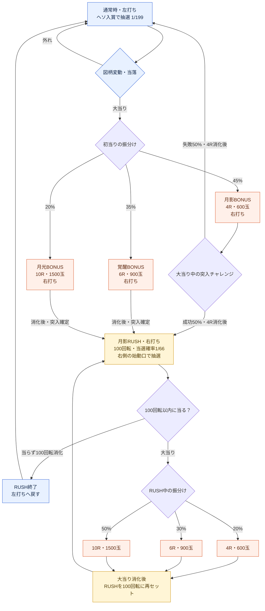

# 初号機「月影機関」採用遊技フロー

2026-09-23。ユーザーの「いいと思います」により、提示したフローを初号機の基本方針として採用。数値は初期設定値として採用し、試遊による調整対象とする。以下のRUSHとR昇格方式は仕様上の決定であり、現行ゲームにはまだ実装していない。引き続きユーザーからの質問を受ける形式で詳細を検討する。

## 体験の軸

初当りで出玉を得てRUSH突入を目指す。RUSH中は100回転以内に次の当りを引き、当るたび100回転へ戻る。初当りの入口、当り中の昇格、残り回転数からの引戻しの3箇所で期待を作る。保留5個・深い保証天井・ステージ・強化はゲーム側のルールとして維持する。

## フロー

## 初期設定値と意味（調整可能）

- 初当り1/199は基準案を継承。初当り振分け45/35/20は現在の試作値を利用。
- 初当りからのRUSH突入率は45%×50%＋35%＋20%＝77.5%。4Rの失敗でも4R分の賞球は得られる。
- RUSHは1回の消化抽選につき1/66、100回で少なくとも1回当る確率は `1-(65/66)^100`＝約78.3%。独立抽選・スキル補正なし・100回転部分のみ。別の78.3%抽選を最後に行う方式ではない。残保留による追加の引戻しはこの数字に含めず、終了境界の受付・消化方法は詳細設計で明示する。
- 「回転」は玉の発射数ではなく、図柄の抽選消化回数。大当りラウンド消化中はRUSH回転数を消費しない。
- 600/900/1500玉は基礎賞球15×10カウント×4/6/10R。全カウント入賞時の払出で、発射消費を引く前・コース倍率や永続／ラン内強化を加える前。時間切れで入賞が不足すれば減る。
- 100回転と1/66は採用フローの初期設定値であり、実機の平均値という意味ではない。

## 演出

- 通常は左→中央→右停止。リーチは左・中央一致後に告知し、右の決着まで戦闘・復活等で期待を作る。
- 初当り4Rは敵撃破／防衛成功でRUSH、敗北なら出玉を得たうえで通常へ。演出結果は選ばれた突入結果を表現し、ボタン入力等で再抽選しない。
- RUSH中は通常より短い変動が中心。残り回転数が少ないときのリーチ、当り中のR昇格で盛り上げる。
- R昇格：当選時に決まった最終4R/6R/10Rを段階的に告知する。4R表示から6R、さらに10Rへ見せる場合がある。初めから10R確定を見せる場合も用意する。

## 採用した変更と実装との差分

- 現在はない右側の始動口（電チュー相当）とRUSH状態を追加する。RUSH中もアタッカーが開きっぱなしという意味ではない。抽選用の入口と当選後の賞球用アタッカーを分ける。
- 現在の同一大当りへ新規抽選でR数を繰り返し追加する方式を、この案では「当選済みの最終R数を途中で告知する演出」と「RUSHで次の大当りを引く継続」に置き換える。2026-09-22の反復R上乗せ仕様を置き換える決定。コードの変更は未実施。
- 追加のLT、出玉なしのRUSH再セット、複数大当りセットは初号機案には入れない。既存の深い天井はゲーム救済として維持する。
- ステージ目標達成はどの状態でも発生し、一時停止してスキル選択。持ち玉・大当りの進行に加えてRUSH残り回転数・保留もそのまま引き継ぐ。最終ステージで終了する既存ルールを維持。
- 初期持ち玉・ステージ目標・RUSH中の玉持ちは、このフローに合わせて調整する必要がある。継続率だけで遊びやすさや攻略難易度を保証しない。

## 用語の参照

SANKYO「初心者にもわかるスペックの見方～パチンコ篇①～」https://www.sankyo-fever.jp/research/31/ 。通常／高確率状態、ST回数、電サポ、ラウンド・カウント・払出の区別を参考にした。上記の名称・確率・振分けは架空台の初期設定値。
