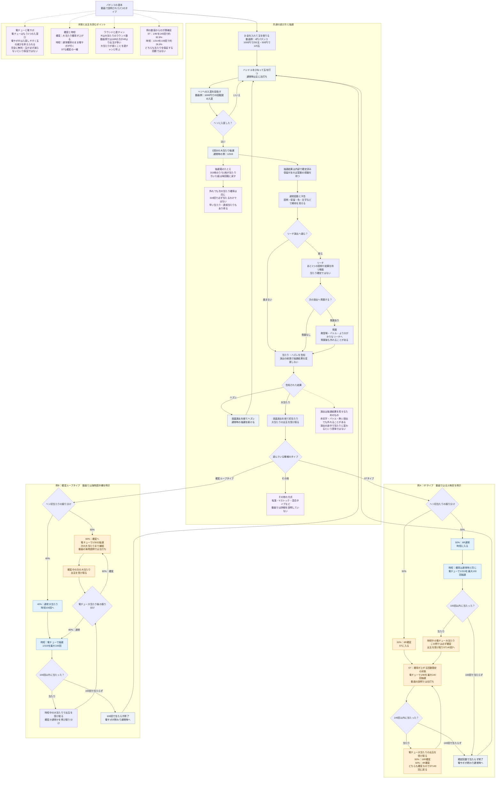

# パチンコの概要とゲームの流れ

パチンコは、玉を打って入賞口に入れ、大当たりの抽選を受ける遊びです。液晶演出を経て大当たりすると出玉を得られ、その後の状態によって次の当たりやすさや抽選できる回数が変わります。

この資料は動画「【確変とは？】世界一丁寧なパチンコ初心者講座【時短って？】」の[文字起こし](パチンコ初心者講座_IRvp0ammDbg.txt)を整理したものです。動画が扱う基本の抽選、STタイプ、確変ループタイプを中心に説明し、会話で確認したリーチ・発展などの用語を補足します。確率・回数・振り分け・出玉は動画内の説明例であり、すべての機種に共通する仕様や現在の規則を示すものではありません。

## 1. 玉を打って大当たりの抽選を受ける

1. お金を入れて玉を借りる。動画の4円パチンコの例では、1000円で250玉、500円で125玉。
2. ハンドルをひねり、玉を連続して打つ。
3. 通常時は主に左打ちで「ヘソ」と呼ばれる入賞口を狙う。
4. ヘソへの入賞で、1回分の大当たり抽選を受ける。
5. 液晶の図柄や演出を経て、当たり・ハズレが示される。
6. ハズレなら抽選を続け、大当たりなら出玉を受け取る。

打った玉がすべて抽選に使われるわけではありません。動画では「1000円で20回程度ヘソに入れば良い」という目安を例示していますが、回り方は機種や台の状態で変わります。

## 2. 大当たり確率と液晶演出の関係

### 1/319は319回で必ず当たるという意味ではない

動画は、通常時の大当たり確率を **1/319** として説明しています。これは1回ごとの抽選で当たる確率です。

たとえ話では、319枚の紙が入った箱に当たりが1枚あります。1枚引いた後は、その紙を箱に戻して混ぜ、次の抽選をします。外れた紙を取り除かないため、同じ状態で抽選を続ける限り、外れが続いても次の1回の当たり確率は変わりません。最初の1回で当たることも、連続して当たることも、319回を超えて外れることもあります。

動画では過去の例として1/399、1/499にも触れています。これらを含め、動画内の数値は説明された時点の文脈で読む必要があります。

### 演出は抽選結果を伝える

動画では、入賞を契機とする抽選で当たり・ハズレが決まり、液晶演出はその結果を楽しませながら見せるものと説明しています。

赤文字、バトル、強い演出などが出ても、それだけで当たりが確定するわけではありません。「信頼度90%」のような表現も、必ず当たるという意味ではありません。演出が進むにつれて新たに当たりへ変わる、という理解ではありません。

### リーチと発展の違い

以下は動画の説明に、会話で確認した「発展」の意味を補足した整理です。

- **変動**：図柄が動き、抽選結果を見せるまでの演出が進むこと。
- **予告**：色・文字・人物・役物などで、大当たりへの期待を示す演出。
- **リーチ**：図柄があと1つ揃えば大当たり、という形などで結果への期待を持たせる場面。リーチ自体は大当たり確定ではありません。
- **発展**：演出が次の段階へ進むこと。特に、リーチからより大がかりなリーチやバトルへ進む場面で使います。
- **信頼度**：その演出が出たとき、大当たりに結びつく割合として示される期待の目安。1回ごとの大当たり抽選確率とは区別します。
- **保留**：まだ変動が始まっていない入賞分を、上限の範囲で順番待ちとして保持するもの。表示方法や上限は機種によって異なります。

例えば、`通常変動 → リーチ成立 → 敵登場 → バトルリーチへ発展 → 勝敗告知 → 通常へ復帰／大当たり`という流れです。機種によって経路は異なり、すべての変動がリーチや発展を通るわけではありません。

「発展すればチャンス」は、その先の演出に進むと当たりへの期待が高まるという意味です。発展後も外れることがあり、発展・PUSH操作・派手な役物作動をきっかけに当たりを新しく抽選するという意味ではありません。

## 3. 用語と状態の違い

| 用語 | 意味・役割 |
|---|---|
| ヘソ | 通常時に大当たり抽選を受けるために狙う入賞口。 |
| 電チュー | 動画で「第二のヘソ」と説明される、もう1つの入賞口。 |
| 電サポ | 電チューへの入賞を助け、玉の減少を抑えながら抽選を続けやすくする状態。 |
| 通常時 | 動画の例では、ヘソを狙い1/319で初当たりを目指す状態。 |
| 初当たり | 通常時から最初に引いた大当たり。 |
| 確変 | 「確率変動」の略。大当たり確率が通常時より高くなる状態。 |
| ST | 決められた回数だけ確変が続くタイプ。回数内に当たらないと終了する。 |
| 確変ループ | 次の大当たりまで確変が続き、大当たり後の振り分けで確変継続か通常かが決まるタイプ。 |
| 時短 | 大当たり確率は通常時と同じまま、決められた回数の電サポが付く状態。 |
| 振り分け | 大当たりの種類、ラウンド数、その後の状態などの割合。ヘソと電チューで異なる場合がある。 |
| ラウンド／R | 大当たり中の出玉獲得を区切る単位。動画の例では、16Rの方が4Rより出玉が多い。 |
| 連チャン | 大当たりが続くこと。 |
| 引き戻し | 時短などで再び大当たりを引くこと。 |
| 継続率 | 次の大当たりへつながる割合を表す指標。どの状態を含めるかは機種の仕様による。 |
| 左打ち／右打ち | 玉を流す方向の違い。ハンドルを調整して、指定された方向へ打つ。 |

**確変と電サポは別の要素です。** 確変は「当たり確率」、電サポは「入賞しやすさと玉の消費」に関係します。ST・確変ループでは確率が上がりますが、時短では上がりません。

動画の「ほぼ無料」という表現は、電サポで玉の消費を抑えやすいことを表しています。完全に無料になる、玉が必ず減らなくなる、打った玉が必ず電チューに入るという保証としては扱いません。

## 4. 例A STタイプ

動画では北斗無双を例に、次のようなモデルで説明しています。

### 初当たり後の振り分け

ヘソで1/319の大当たりを引き、出玉を受け取ります。初当たりの出玉は説明中に500玉という例も出ています。

| 割合 | 大当たりの種類 | 大当たり後の状態 |
|---|---|---|
| 50% | 6R確変 | ST140回へ。 |
| 50% | 6R通常 | 時短100回へ。 |

### STに入った場合

右打ちで電チューへの入賞を目指し、**1/80の抽選を最大140回**受けます。

- 140回以内に当たると、出玉を受け取り、STの回数が再び140回になる。
- 電チュー大当たりの振り分けは、50%が16R確変、50%が4R確変。
- この例では、出玉の多寡は違っても、どちらも確変なのでSTを続けられる。
- 140回で当たらなければ、通常時へ戻ってヘソの初当たりを目指す。

### 時短に入った場合

電チューで **1/319の抽選を最大100回**受けます。確率は通常時と同じです。

- 100回以内に当たれば、この例の電チュー大当たりは必ず確変となり、ST140回へ入る。
- 100回で当たらなければ、通常時へ戻る。

この例では、時短中も電チューで抽選するため、当たりさえ引けばヘソ初当たりの「50%確変・50%通常」という振り分けには戻りません。

## 5. 例B 確変ループタイプ

動画では海物語の沖縄シリーズを例に説明しています。この例の海物語は右打ちを使わず、左打ちで遊びます。

### 初当たり後の振り分け

| 割合 | 大当たりの種類 | 大当たり後の状態 |
|---|---|---|
| 60% | 確変大当たり | 次の大当たりまで確変。 |
| 40% | 通常大当たり | 時短100回へ。 |

### 確変に入った場合

電チューで **1/30の抽選を、次の大当たりまで**受けます。STのような規定回数による終了がないため、動画では「次の大当たりが得られる状態」と説明しています。何回で当たるかは決まっていません。

大当たりすると出玉を受け取り、その後の状態を再び振り分けます。

- 60%の確変を引けば、次の大当たりまで確変を継続する。
- 40%の通常を引けば、出玉を受け取った後に時短100回へ移る。

STの例と異なり、電チューで当たっても通常大当たりになる場合があります。

### 時短に入った場合

電チューで **1/319の抽選を最大100回**受けます。

- 当たれば、出玉を受け取った後に60%確変・40%通常を再び振り分ける。
- 確変なら確変ループへ戻る。
- 通常なら再び時短100回になる。
- 100回で当たらなければ、通常時へ戻る。

動画では沖縄5の時短回数にも触れていますが、話者自身が数値を確定していません。そのため、この資料と図では説明用の100回を採用し、実機仕様として断定していません。

## 6. 2つのタイプの比較

| 比較する点 | STタイプの例 | 確変ループタイプの例 |
|---|---|---|
| 通常時の確率 | 1/319 | 1/319 |
| ヘソ初当たり後の確変割合 | 50% | 60% |
| 確変中の確率 | 1/80 | 1/30 |
| 確変が続く期間 | 最大140回 | 次の大当たりまで |
| 確変中に当たった後 | 必ずST140回へ戻る | 60%で確変、40%で時短へ |
| 時短の確率・回数 | 1/319・100回 | 1/319・100回 |
| 時短中に当たった後 | 必ずSTへ | 60%で確変、40%で再び時短へ |
| 当たらず終了する条件 | ST140回または時短100回を消化 | 時短100回を消化 |
| 打ち方の例 | 電サポ中は右打ち | 動画の海物語例は左打ち |

## 7. 回数と確率の計算補足

以下は動画の数値から計算した補足です。同じ確率で独立した抽選を続ける場合、1回の当たり確率を `p`、抽選回数を `n` とすると、回数内に1回以上当たる確率は次の式です。

```text
回数内に1回以上当たる確率 = 1 - (1 - p)^n
```

| 状態 | 計算 | 結果 |
|---|---|---|
| STの例 | `1 - (79/80)^140` | 約82.8%。動画では約80%と説明。 |
| 時短の例 | `1 - (318/319)^100` | 約26.9%。動画の約27%という説明に対応。 |

これは回数内に当たる確率であり、保証ではありません。また、確変ループの「60%」は大当たり後の確変振り分けです。時短での引き戻しまで含めた継続の割合と同一ではありません。

動画では転落タイプ、Vストック、混合タイプなどの存在にも触れていますが、詳細な仕組みは説明していません。STと確変ループの2種類だけで全機種を説明できる、という意味ではありません。

## 8. 全体を整理した Mermaid

実線は遊び方や状態の移り変わり、点線は説明の補足です。大当たりの種類や振り分けは、理解のため順に配置しています。液晶演出の途中で改めて当たりを決めることを示す図ではありません。


